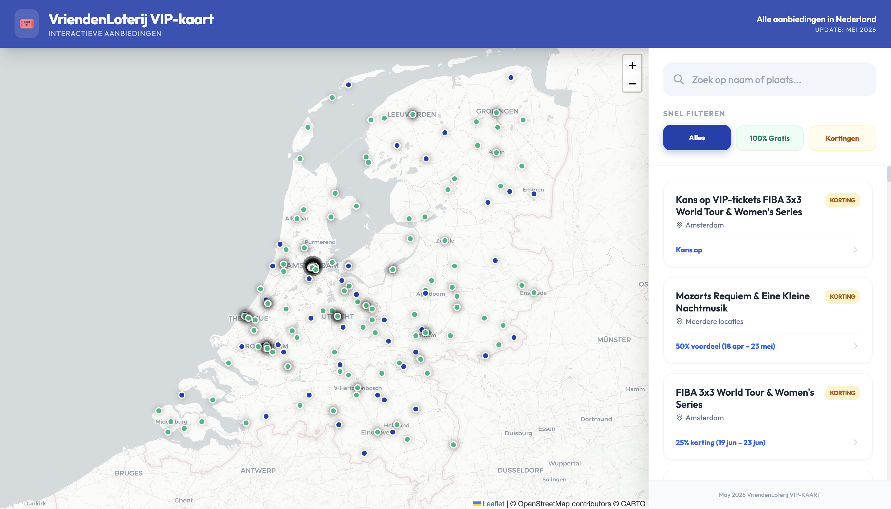
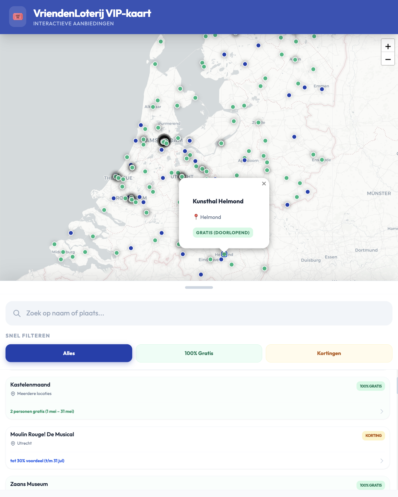

# VIP-KAART Interactive Map

A modern, high-performance interactive map designed to showcase VIP-KAART offers and benefits. This application provides a premium user experience with a focus on mobile responsiveness and clean aesthetics.

  
  

---

## 🇳🇱 Beschrijving (Dutch)

Met behulp van deze website (gehost op **vlot.codcl.com**) kun je op een interactieve kaart alle musea en locaties bekijken die je **gratis** of **met korting** kunt bezoeken met de **VIP-KAART van de VriendenLoterij**.

De applicatie maakt het eenvoudig om snel interessante plekken te vinden, te filteren op type voordeel (gratis of korting) en direct te zien waar deze zich bevinden. Dankzij het mobile-first ontwerp en de moderne interface is de kaart zowel op desktop als smartphone intuïtief en prettig in gebruik.

---

## 🇬🇧 Description (English)

Using this website (hosted at **vlot.codcl.com**), you can explore an interactive map displaying all museums and locations that can be visited **for free** or **with discounts** using the **VIP-KAART from the VriendenLoterij**.

The application allows users to quickly discover interesting places, filter them by benefit type (free or discounted), and instantly view their locations. With its mobile-first design and modern interface, the map is intuitive and easy to use on both desktop and mobile devices.

---

## ✨ Features

- **📍 Interactive Mapping**: Powered by Leaflet.js with clean CartoDB light tiles.
- **📱 Mobile-First Design**: Featuring a draggable, snapping bottom sheet for easy navigation on smartphones.
- **🔍 Real-Time Filtering**: Instant search and filtering by category (Gratis vs. Discounts).
- **💎 Premium Aesthetics**:  
  - Modern typography using the **Outfit** Google Font  
  - Glassmorphism effects for the header  
  - Smooth micro-animations and transitions  
  - Custom elegant scrollbars and card designs  
- **⚡ Performance**: Lightweight vanilla JavaScript implementation with Tailwind CSS for rapid UI styling.

---

## 🚀 Tech Stack

- **Frontend**: HTML5, Vanilla JavaScript  
- **Styling**: Tailwind CSS (CDN), Custom Vanilla CSS  
- **Maps**: Leaflet.js  
- **Tiles**: CartoDB Voyager Light  

---

## 🛠️ Usage

Simply open `index.html` in any modern web browser. No build process is required as it uses CDN-hosted dependencies.

---

## 📄 License

This project is open-source. You are free to use, modify, and distribute it.

**Requirement**: You must provide a clear link to the original developers in your project's credits:

- **Developed by**: [Coders Club Inc.](https://codcl.com)  
- **Author**: [Aleksandr Shaman](https://www.linkedin.com/in/alexshw)

---

*Part of the VIP-KAART ecosystem improvement project.*
